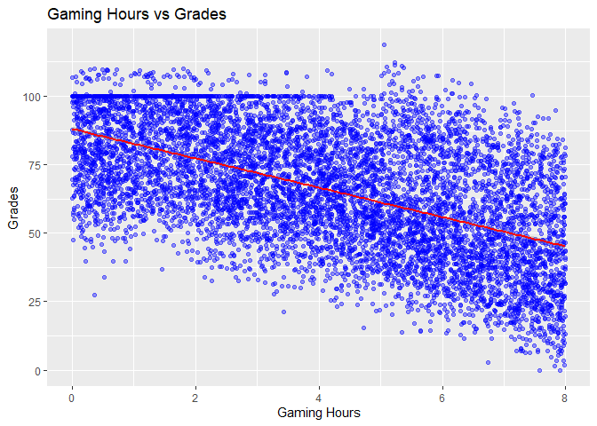
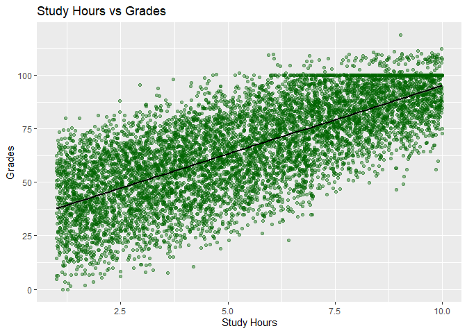
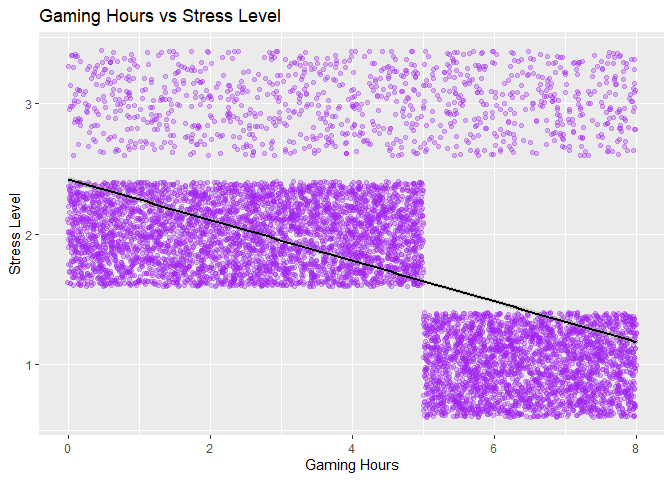
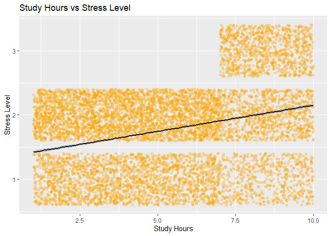

DS2020_Final_Project
================
Trey Hartung
2026-05-12

\#Analysis on the Effects of Gaming on Academic Performance \#### Trey
Hartung

## Introduction

The purpose for this project is to figure out the relationship between
gaming and academic performance for students. Many students students
play video games, myself included, so it is important to understand how
exactly this can affect our studies.

For this purpose I ask the following questions:

1.  Does gaming time affect student grades?

2.  Do study hours improve academic performance?

3.  How do gaming time and study hours affect stress level?

These questions are the main things I am curious about and will try to
answer throughout this project. With the answers to these questions I
will be able to find meaningful conclusions on how gaming cam relate to
academic performance.

## Data

### Structure

The dataset can be found at
<https://www.kaggle.com/datasets/aiexplorer77/gaming-vs-academic-performance>
. This website provides the csv file containing the data that will be
used for this project. The dataset is composed of 8000 observations with
14 variables each. For this project the most instrumental variables for
my questions will be ones such as gaming hours, study hours, stress
level, and grades. The data is already in an easy to work with form, so
no cleaning will be necessary after loading the dataset.

### Variables

- student_id: The unique identifier for each student.
- age: The age of the student.
- gender: The gender of the student.
- gaming_hours: The average number of hours spent gaming each day.
- study_hours: The average number of hours spent studying each day.
- sleep_hours: The average number of hours spent sleeping each day.
- attendance: The percentage of classes that the student attends.
- gaming_genre: The student’s preferred genre of game.
- social_activity: The number of hours spent on social activities each
  day.
- device_usage: The total daily screen time each day.
- reaction_time_ms: The cognitive reaction time in milliseconds.
- addiction_score: The Estimated gaming addiction level.
- stress_level: The Stress category of the student.
- grades: The academic performance score of the student.

## Results

``` r
library(readr)
library(tidyverse)
```

    ## ── Attaching core tidyverse packages ──────────────────────── tidyverse 2.0.0 ──
    ## ✔ dplyr     1.1.4     ✔ purrr     1.2.1
    ## ✔ forcats   1.0.1     ✔ stringr   1.6.0
    ## ✔ ggplot2   4.0.1     ✔ tibble    3.3.1
    ## ✔ lubridate 1.9.4     ✔ tidyr     1.3.2
    ## ── Conflicts ────────────────────────────────────────── tidyverse_conflicts() ──
    ## ✖ dplyr::filter() masks stats::filter()
    ## ✖ dplyr::lag()    masks stats::lag()
    ## ℹ Use the conflicted package (<http://conflicted.r-lib.org/>) to force all conflicts to become errors

``` r
student_data <- read_csv("Gaming_Academic_Performance.csv")
```

    ## Rows: 8000 Columns: 14
    ## ── Column specification ────────────────────────────────────────────────────────
    ## Delimiter: ","
    ## chr  (3): gender, gaming_genre, stress_level
    ## dbl (11): student_id, age, gaming_hours, study_hours, sleep_hours, attendanc...
    ## 
    ## ℹ Use `spec()` to retrieve the full column specification for this data.
    ## ℹ Specify the column types or set `show_col_types = FALSE` to quiet this message.

### Does gaming time affect student grades?

#### Correlation

``` r
cor(student_data$gaming_hours, student_data$grades)
```

    ## [1] -0.5513117

This correlation value means that gaming hours and grades have a
moderate negative linear relationship.Based on this, we can expect a
graph of the data to show grades get worse the more hours spent gaming a
student has.

#### Scatterplot

``` r
scatterplot1 <- ggplot(student_data, aes(x = gaming_hours, y = grades)) +
  geom_point(alpha = 0.4, color = "blue") +
  geom_smooth(method = "lm", color = "red") +
  labs(
    title = "Gaming Hours vs Grades",
    x = "Gaming Hours",
    y = "Grades"
  )

print(scatterplot1)
```

    ## `geom_smooth()` using formula = 'y ~ x'

<!-- -->

The plot above shows exactly what was expected from the correlation
value, a mostly linear, negative relationship. It shows that students
who spend more time gaming generally have lower grades than those who do
not game as much.

#### Linear regression

``` r
LRmodel1 <- lm(grades ~ gaming_hours, data = student_data)
summary(LRmodel1)
```

    ## 
    ## Call:
    ## lm(formula = grades ~ gaming_hours, data = student_data)
    ## 
    ## Residuals:
    ##     Min      1Q  Median      3Q     Max 
    ## -58.809 -14.113  -0.702  14.465  57.615 
    ## 
    ## Coefficients:
    ##              Estimate Std. Error t value Pr(>|t|)    
    ## (Intercept)   88.0564     0.4252   207.1   <2e-16 ***
    ## gaming_hours  -5.3541     0.0906   -59.1   <2e-16 ***
    ## ---
    ## Signif. codes:  0 '***' 0.001 '**' 0.01 '*' 0.05 '.' 0.1 ' ' 1
    ## 
    ## Residual standard error: 18.71 on 7998 degrees of freedom
    ## Multiple R-squared:  0.3039, Adjusted R-squared:  0.3039 
    ## F-statistic:  3492 on 1 and 7998 DF,  p-value: < 2.2e-16

I chose to do a linear regression model with this data to see just how
much gaming lowers grades. The number I focus on from the summary data
is the estimate for gaming hours in the “Coefficients” section. This
tells us that with every hour spent gaming, grades get worse by 5.35
points on average.

### Do study hours improve academic performance?

#### Correlation

``` r
cor(student_data$study_hours, student_data$grades)
```

    ## [1] 0.7331319

This value tells us that study hours and grades have a strong positive
relationship. So we expect grades to increase alongside hours spent
studying.

#### Scatterplot

``` r
scatterplot2 <- ggplot(student_data, aes(x = study_hours, y = grades)) +
  geom_point(alpha = 0.4, color = "darkgreen") +
  geom_smooth(method = "lm", color = "black") +
  labs(
    title = "Study Hours vs Grades",
    x = "Study Hours",
    y = "Grades"
  )

print(scatterplot2)
```

    ## `geom_smooth()` using formula = 'y ~ x'

<!-- -->

This plot reaffirms what the correlation value tells us. There is a
clear trend that students who studied for more hours had higher scores
on average than those who did not study as much.

#### Linear regression

``` r
LRmodel2 <- lm(grades ~ study_hours, data = student_data)
summary(LRmodel2)
```

    ## 
    ## Call:
    ## lm(formula = grades ~ study_hours, data = student_data)
    ## 
    ## Residuals:
    ##     Min      1Q  Median      3Q     Max 
    ## -49.414 -10.772   0.808  11.282  45.396 
    ## 
    ## Coefficients:
    ##             Estimate Std. Error t value Pr(>|t|)    
    ## (Intercept)  31.3321     0.3997   78.40   <2e-16 ***
    ## study_hours   6.3819     0.0662   96.41   <2e-16 ***
    ## ---
    ## Signif. codes:  0 '***' 0.001 '**' 0.01 '*' 0.05 '.' 0.1 ' ' 1
    ## 
    ## Residual standard error: 15.25 on 7998 degrees of freedom
    ## Multiple R-squared:  0.5375, Adjusted R-squared:  0.5374 
    ## F-statistic:  9294 on 1 and 7998 DF,  p-value: < 2.2e-16

This linear regression model tells us that for every hour studied,
grades will increase by 6.38 on average.

### How do gaming time and study hours affect stress level?

#### Correlations

``` r
student_data$stress_numeric <- ifelse(student_data$stress_level == "Low", 1, ifelse(student_data$stress_level == "Medium", 2, 3))

cor(student_data$gaming_hours, student_data$stress_numeric)
```

    ## [1] -0.5524177

``` r
cor(student_data$study_hours, student_data$stress_numeric)
```

    ## [1] 0.3211446

For this question, the first thing I did was convert the stress levels
into numeric values to make them easier to use in statistical analysis.
These correlation values indicate that gaming hours and study hours have
moderate negative and weak positve relationships with stress
respectively.

#### Multiple regression

``` r
stress_model <- lm(stress_numeric ~ gaming_hours + study_hours, data = student_data)
summary(stress_model)
```

    ## 
    ## Call:
    ## lm(formula = stress_numeric ~ gaming_hours + study_hours, data = student_data)
    ## 
    ## Residuals:
    ##      Min       1Q   Median       3Q      Max 
    ## -1.00168 -0.34502 -0.09339  0.24914  1.67711 
    ## 
    ## Coefficients:
    ##               Estimate Std. Error t value Pr(>|t|)    
    ## (Intercept)   1.980377   0.016544  119.71   <2e-16 ***
    ## gaming_hours -0.154540   0.002429  -63.63   <2e-16 ***
    ## study_hours   0.079555   0.002177   36.55   <2e-16 ***
    ## ---
    ## Signif. codes:  0 '***' 0.001 '**' 0.01 '*' 0.05 '.' 0.1 ' ' 1
    ## 
    ## Residual standard error: 0.5015 on 7997 degrees of freedom
    ## Multiple R-squared:  0.4046, Adjusted R-squared:  0.4044 
    ## F-statistic:  2717 on 2 and 7997 DF,  p-value: < 2.2e-16

Based on this regression model, we see that on average, more time spent
gaming reduces the level of stress that students feel, whereas studying
does the opposite. It is important to note, however, that stress level
was originally categorical in nature. This means that analyzing them
numerically is not always appropriate. In this case it is still useful
to at least see the direction of the relationship (positive vs negative)
for gaming and studying on stress.

#### Gaming vs stress

``` r
stress_plot1 <- ggplot(student_data,
                aes(x = gaming_hours, y = stress_numeric)) +
  geom_jitter(alpha = 0.3, color = "purple") +
  geom_smooth(method = "lm", color = "black") +
  labs(
    title = "Gaming Hours vs Stress Level",
    x = "Gaming Hours",
    y = "Stress Level"
  )

print(stress_plot1)
```

    ## `geom_smooth()` using formula = 'y ~ x'

<!-- -->

This plot for gaming hours and stress level shows that for any number of
hours spent gaming, some students always had high levels of stress. It
also shows that at 5+ hours of gaming, there is no more medium level
stress reported and a large amount of low level stress reported. This
seems somewhat unnatural so it would be proper to investigate how this
data was sampled to look for an explanation for this.

#### Study hours vs stress

``` r
stress_plot2 <- ggplot(student_data,
                aes(x = study_hours, y = stress_numeric)) +
  geom_jitter(alpha = 0.3, color = "orange") +
  geom_smooth(method = "lm", color = "black") +
  labs(
    title = "Study Hours vs Stress Level",
    x = "Study Hours",
    y = "Stress Level"
  )

print(stress_plot2)
```

    ## `geom_smooth()` using formula = 'y ~ x'

<!-- -->

A similar plot is used for modeling study hours and stress level. This
plot shows that at all amounts of hours spent studying, there are always
students reporting low and medium levels of stress. Below 7 hours of
studying, there are no reports of high stress levels, whereas at 7+
hours of studying, there are frequent reports of high level stress. This
also seems somewhat unnatural that there is no high level stress until
after 7 hours of studying. Further investigation to confirm this data
would be appropriate.

## Conclusion

In conclusion, my analysis on the effects of gaming on academic
performance confirm the intuitive answers to how gaming and studying
relate to grades and stress. However, putting numerical values to these
effects allow for better planning and/or management for how students
spend their time and what they can expect the results of their choices
to be. For instance, based on the correlation and coefficient values, it
is shown that studying has a greater affect on grade positively than
gaming does negatively. Similarly, gaming is more effective at lowering
stress than studying is as raising stress. This suggests that a balance
of gaming and studying is important in order to keep grades high without
stressing yourself out too much.

Further analysis would be appropriate to get even more information on
this topic. factoring in aspects like how much sleep students get or how
often they attend classes would increase the understanding on what
exactly affects grades and stress the most. It is also important to
consider that lower grades that appear to come from many hours of gaming
could really be caused simply by low hours studying.

Overall, this project was worthwhile to me as a student who enjoys video
games while also understanding the importance of studying. I will
certainly think back to this project whenever I debate with myself on
how to best spend my time.
